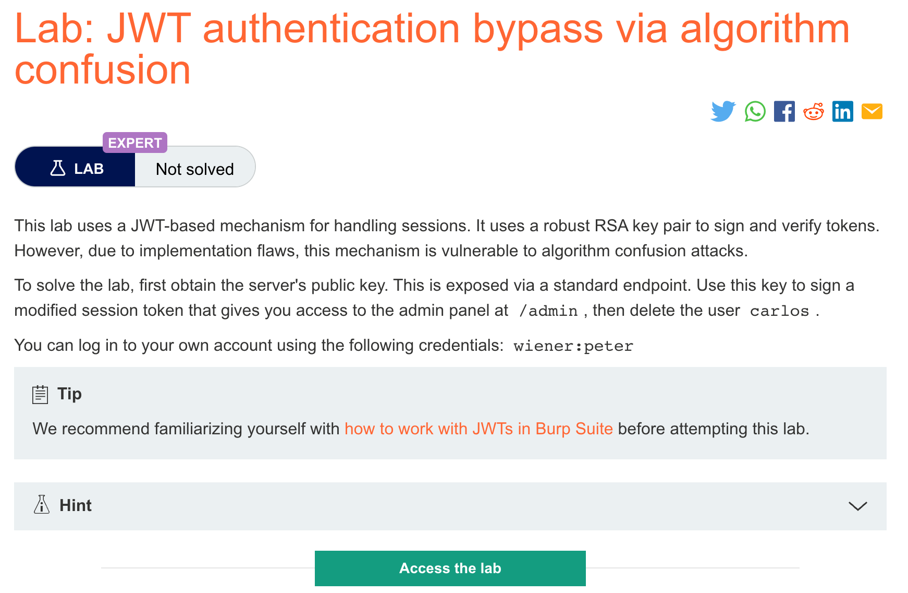
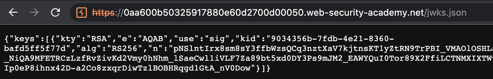
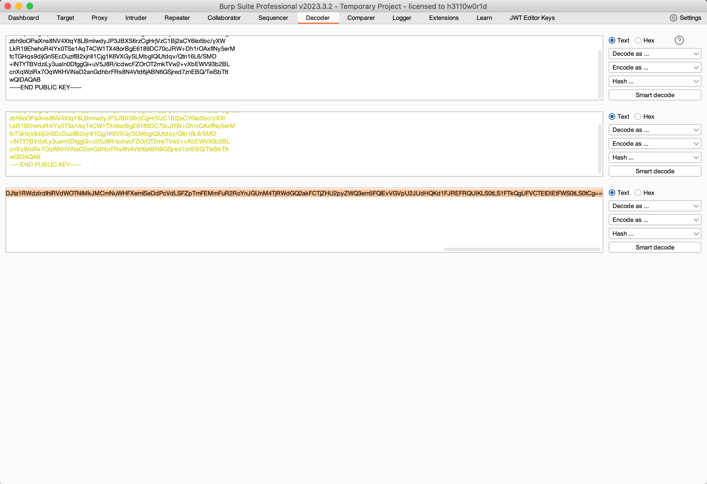
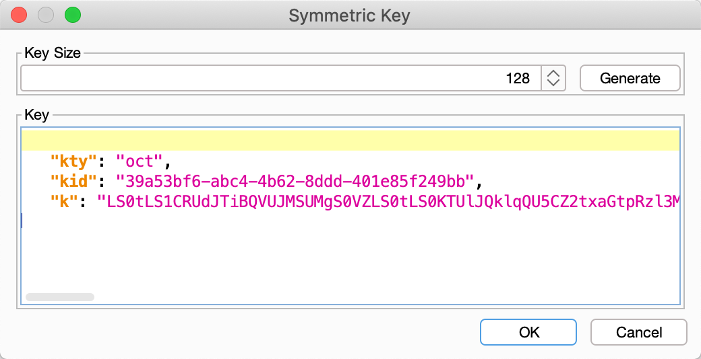
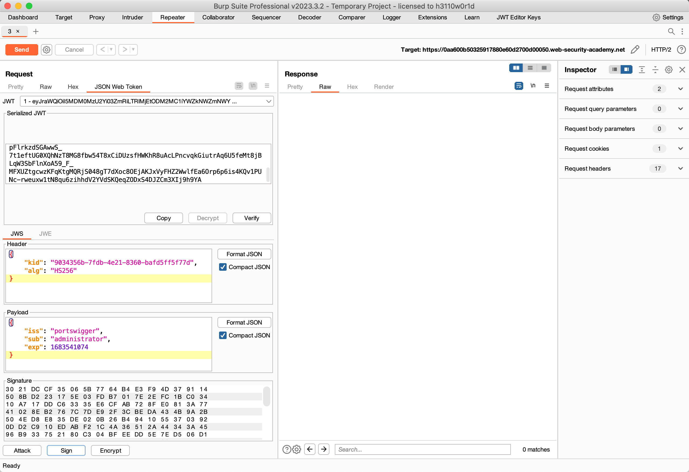
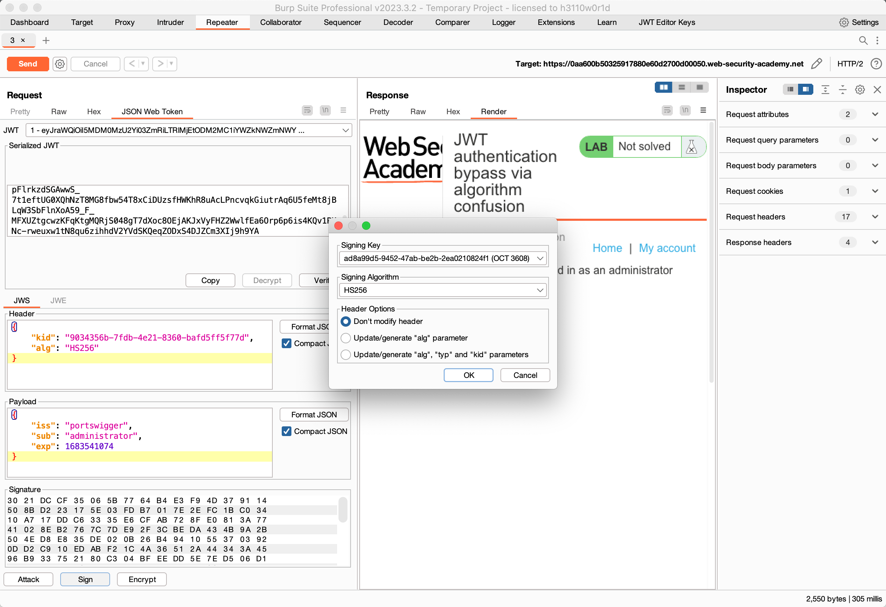

# 题意


登录到admin界面，然后删除carlos字段视为成功。
# 解题思路
step1:获得服务端公钥
用普通用户登录后，修改url获取服务端公钥



step2:将公钥转换为适合的格式
先生成一个RSA密钥,将密钥复制为PEM格式后对其进行BASE64编码


再生成一个对称算法的密钥，并用上一步的编码结果替换掉该密钥中的k字段。


step3：修改JWT
修改JWT。主要是修改URL、sub字段改成administrator、alg字段改成HS256.

step4:用公钥对JWT签名
用第二步生成的对称密钥对JWT进行签名即可

# 知识点
## 算法混合攻击
攻击者强迫服务器使用与开发者设置的不同的解密算法就叫做算法混合攻击。攻击者可以达到伪造合法的JWT，该JWT不需要知道服务端的签名密钥，并且可以携带任意的信息。


## 算法混合攻击发生的场景

通常是由对JWT库的不规范使用引起的。尽管实际的认证过程根据使用的算法会有所不同，但是许多库只提供一种与算法无关的认证函数。这些函数依赖与header中的alg参数。例如：
```
function verify(token, secretOrPublicKey){
    algorithm = token.getAlgHeader();
    if(algorithm == "RS256"){
        // Use the provided key as an RSA public key
    } else if (algorithm == "HS256"){
        // Use the provided key as an HMAC secret key
    }
}
```
使用这个函数的网站开发者可能认为这个函数只能用非对称算法如RS256来处理JWT，由于这个误解，他们可能会向这个函数传递一个固定的key：
```
publicKey = <public-key-of-server>;
token = request.getCookie("session");
verify(token, publicKey);
```
在这种情况下，如果服务端接收到一个用例如HS256这种加密算法加密的token，就会自动调用verify()函数，并且将公钥作为HMAC的密钥。这意味着攻击者可以用HS256对token签名，服务端用相同的公钥对签名进行确认。

