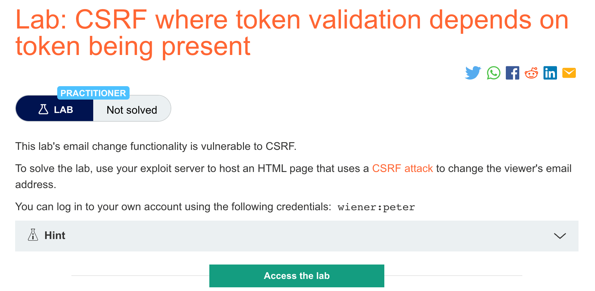
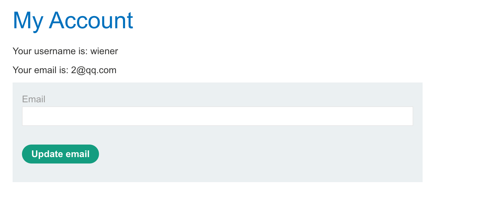
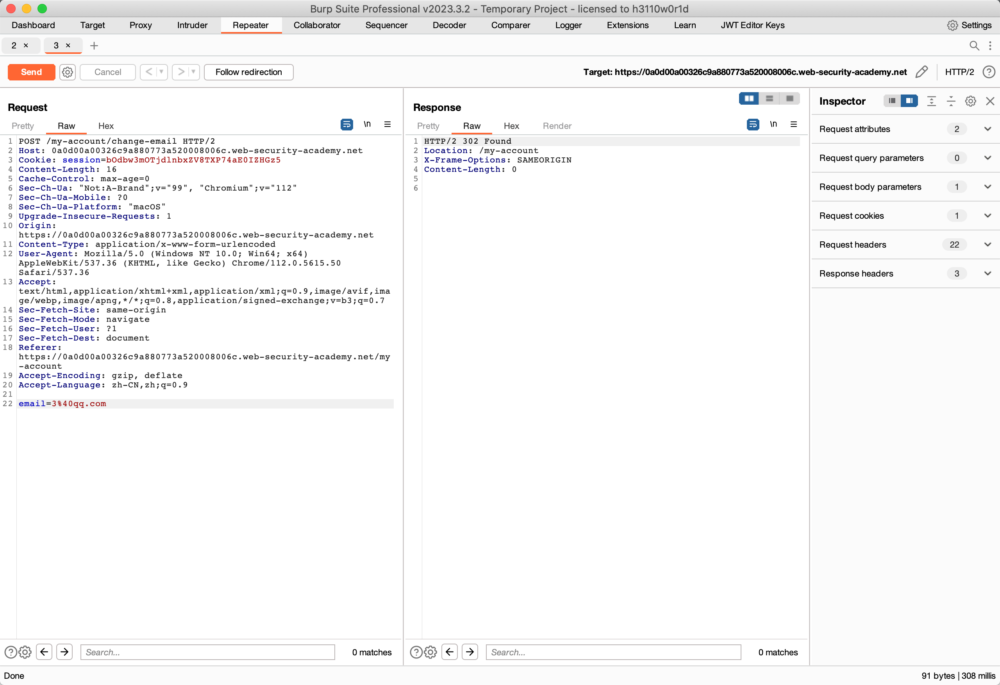

# 题意

修改邮箱地址即可。
# 解题思路
step1:登录后修改邮箱地址，并将bp捕获到的http请求发送的repeator中。


step2:将请求中的csrf字段全部删除后再发送请求，发现可以成功修改邮箱。



step3:生成csrfpoc并复制到exploit server。

# 知识点
## CSRF缺陷
一些应用程序当token存在时可以正确验证，但当token消失时会跳过验证。
这种情况下，攻击者可以移除整个包含token的字段，不仅仅只是把token值删除，来绕过验证。

```
POST /email/change HTTP/1.1
Host: vulnerable-website.com
Content-Type: application/x-www-form-urlencoded
Content-Length: 25
Cookie: session=2yQIDcpia41WrATfjPqvm9tOkDvkMvLm

email=pwned@evil-user.net
```