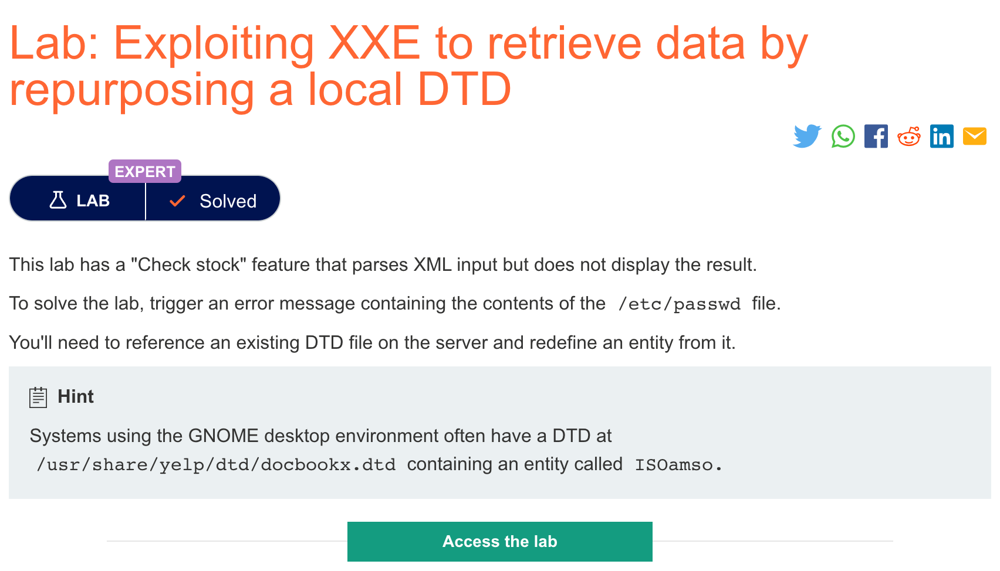
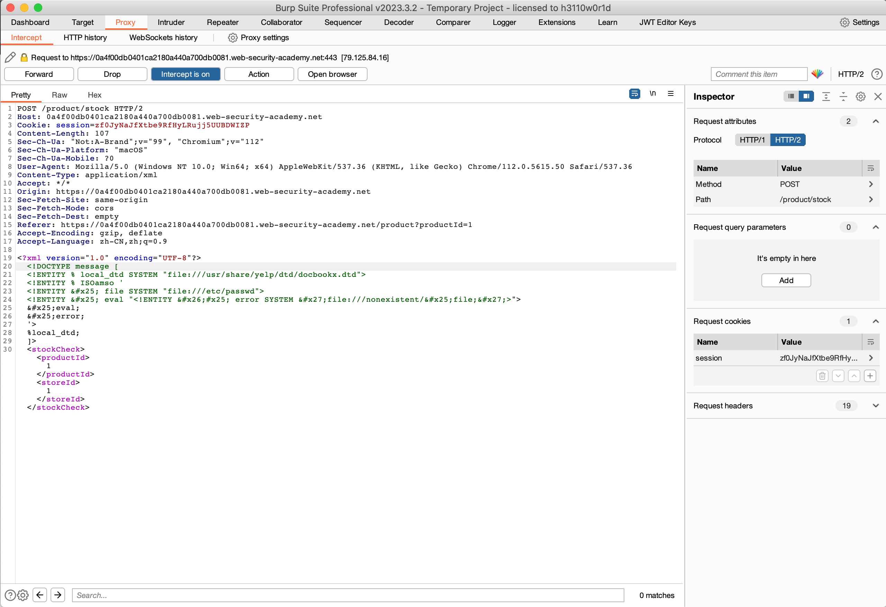
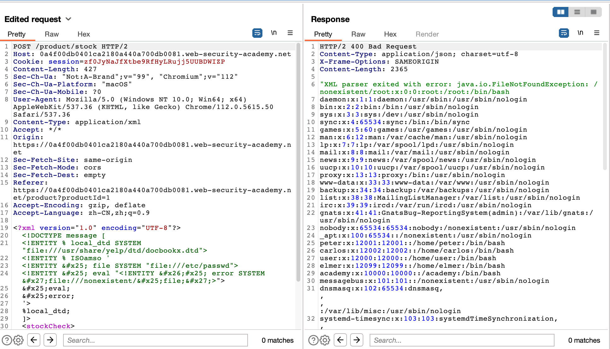

# 题意


获取passwd文件的内容
# 解题思路
首先还是抓包并且写入payload:



发送即可




# 知识点
## 利用重用本地DTD实现盲注XXE
之前的方法都只适用于外部DTD，但是一般不适用于完全定义在DOCTYPE元素里的内部DTD。这是因为之前的方法包含了一个带有另一个实体的定义的XML参数实体。但是内部实体不允许这种写法。这种情况下，如果文件的DTD使用了内部和外部混合实体声明，那么内部DTD可以重定义哪些声明在外部DTD里的实体。这意味着攻击者可以在内部 DTD 中使用基于错误的 XXE 技术，前提是他们使用的 XML 参数实体正在重新定义在外部 DTD 中声明的实体。当然，如果带外连接被阻塞，之后的外部DTD无法从远程被装载，于是外部DTD只能是应用程序服务器本地的文件。从本质上讲，攻击涉及调用恰好存在于本地文件系统上的 DTD 文件，并将其重新用于以触发包含敏感数据的解析错误的方式重新定义现有实体。


例如，假设服务器上有路径为/usr/local/app/schema.dtd的文件，并且这个DTD文件定义了一个名为custom_entity的实体。攻击者可以利用如下混合DTD来出发XML解析器的报错：
```
<!DOCTYPE foo [
<!ENTITY % local_dtd SYSTEM "file:///usr/local/app/schema.dtd">
<!ENTITY % custom_entity '
<!ENTITY &#x25; file SYSTEM "file:///etc/passwd">
<!ENTITY &#x25; eval "<!ENTITY &#x26;#x25; error SYSTEM &#x27;file:///nonexistent/&#x25;file;&#x27;>">
&#x25;eval;
&#x25;error;
'>
%local_dtd;
]>

```

该DTD有如下流程：

1. 定义了一个名为local_dtd的XML参数实体，包含在服务器上的文件系统的外部DTD文件的内容
2. 重定义了参数实体custom_entity，这个实体已经在外部DTD文件中定义好了。该实体被重新定义为已经被描述好的包含基于错误的XXE漏洞，其内容是/etc/passwd文件
3. 使用loca_dtd实体，外部DTD被阐释，包括custom_entity的被重定义的值。借此出发报错信息。
   
由于这种XXE需要重利用一个已经存在于服务器文件系统的DTD文件，关键在于定位一个合适的文件。由于应用程序返回 XML 解析器抛出的任何错误消息，因此只需尝试从内部 DTD 中加载本地 DTD 文件即可轻松枚举它们。

例如，linux系统用GNOME桌面环境，一般情况下有文件/usr/share/yelp/dtd/docbookx.dtd。可以通过提交如下XXE载荷来验证文件是否存在：
```

<!DOCTYPE foo [
<!ENTITY % local_dtd SYSTEM "file:///usr/share/yelp/dtd/docbookx.dtd">
%local_dtd;
]>
```
在测试了常见 DTD 文件列表以找到存在的文件后，需要获取该文件的副本并对其进行检查以查找可以重新定义的实体。由于许多包含 DTD 文件的常见系统都是开源的，因此您通常可以通过互联网搜索快速获取文件的副本。